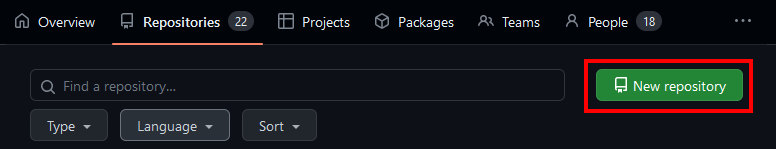

Languages
 

[한국어](./README_ko.md) | [English](./README.md)

# Applicator projects
Every half, held project seminar (offline)  
Improving skill through project and sharing it with others  

## Contents
- [How to join](#how-to-join)  
- [Look around projects](#look-around-projects)
- [FAQ](#faq)

# How to join
## Create work space
### Create new repo in applicator
1. Go to [applicator repositories](https://github.com/orgs/stnuc/repositories)  
2. Create new repo

3. Work
    - Working on origin repo or
    - Fork to own repository and make pull request  

### Fork repo to applicator
1. Create own repo
2. Fork to applicator repository

### Request to project leader
See [history]("") and contact to project leader  

## Request for project explain
Fork this repo and edit your project explain and create pull request
Edit markdown file according to your project quarter  
 
For example, working in 2023, first half then find 2023H1.md and create pull request under the template  

 

# Look around projects
See [project quater list](./projects/projects.md)

 

# FAQ

Can I join only seminar(offline presentation)?

Yes, you can join seminar without any presentation 
Apply participate form to join seminar  

